# Angular 12 and Electron Setup with Webpack 5

For those that have attempted to update your Electron projects to use Angular version 12, you might have noticed that Electron is not playing nice out of the box.  Recent updates to Webpack (version 5) have removed Node polyfills causing issues when trying to instantiate anything Electron related in the browser.  With Webpack abstracted away within Angular, we will need to find another way of adding these polyfills back.

For those that just want the step-by-step resolution (you know who you are....) skip to the bottom.  I've supplied instructions and a diff of all files that need to be updated in a default Angular 12 project.  If you are starting from scratch and want to ensure you are configuring everything correctly, read on.

## Application Setup
Let’s start with the Angular application.  If you haven't already download/install the latest Angular CLI from npm locally.

```npm i -g @angular/cli```

Now create a new project in your desired folder in the terminal of VS Code or any other terminal you prefer.

``` ng n {my-project-name} --style=scss --routing=true```

Once the CLI has finished its thing, let’s ensure that the application works right out of the box.  Navigate into the newly created project folder. 

``` cd {my-project-name} ```

Now start the application

``` ng serve -o ```

The browser should automatically open after the code compiles and you should see the standard Angular application running on http://localhost:4200.  Now that we have confirmed that this works, we can start to break everything.

Install Electron

```npm i -D electron```

To make development in Angular a little easier let’s add a library that wraps the Electron API for us NGX.

``` npm i --save ngx-electron```

From here we need to let the application know how to run itself as an Electron app and not a browser application.  We will need to add some Electron bootstraping to make this happen. Start by creating a new file in the root of your project "app.js".  Note that you will need to update the "my-project-name".  You can also set the desired width and height of the Electron window at this time if you would like.

```
const { app, BrowserWindow } = require('electron')
const url = require("url");
const path = require("path");

let mainWindow

function createWindow() {
  mainWindow = new BrowserWindow({
    width: 800,
    height: 600,
    webPreferences: {
      nodeIntegration: true
    }
  })

  mainWindow.loadURL(
    url.format({
      pathname: path.join(__dirname, `/dist/{my-project-name}/index.html`),
      protocol: "file:",
      slashes: true
    })
  );
  // Open the DevTools.
  mainWindow.webContents.openDevTools()

  mainWindow.on('closed', function () {
    mainWindow = null
  })
}

app.on('ready', createWindow)

app.on('window-all-closed', function () {
  if (process.platform !== 'darwin') app.quit()
})

app.on('activate', function () {
  if (mainWindow === null) createWindow()
})
```

To get the application to execute as the Electron app instead of the web app we need to update our package.json file.  Add an entry point to the package.json through the use of the main property on the root of the file.

```"main": "app.js"```

We also need to add an entry to the script object of the package.json file to execute the Electron app.  This will compile the code and then execute the app using Electron.

```"electron": "ng build --base-href ./ && electron ."```

Let's try running the application.

``` npm run electron ```

Your application is now running in Electron congratulations!  BUT NOT SO FAST!

Let’s try utilizing the Electron API in the application.  We will start with something simple that determines if the application is running in the browser or Electron.

Add ngx-electron to your applications app.module.ts file.

``` import { NgxElectronModule } from 'ngx-electron'; ```

and don't forget to add it to your imports in the same file.

Now open your app.component.ts file and replace the contents with the following.  Note we are just adding the electron service from ngx-electron and injecting it into the constructor.  OnInit we are using the electron API to update the title based upon if the app is running in the browser or Electron.

```
import { Component } from '@angular/core';
import { ElectronService } from 'ngx-electron';

@Component({
  selector: 'app-root',
  templateUrl: './app.component.html',
  styleUrls: ['./app.component.scss']
})

export class AppComponent {
  title = 'Angular 12 Electron Webpack5 Demo';
  constructor(private es: ElectronService) {}

  ngOnInit() {
    this.es.isElectronApp ? this.title = "Electron Application" : this.title = "Standard Angular Web Application";
  }
}
```

Run the application again

``` npm run electron ```

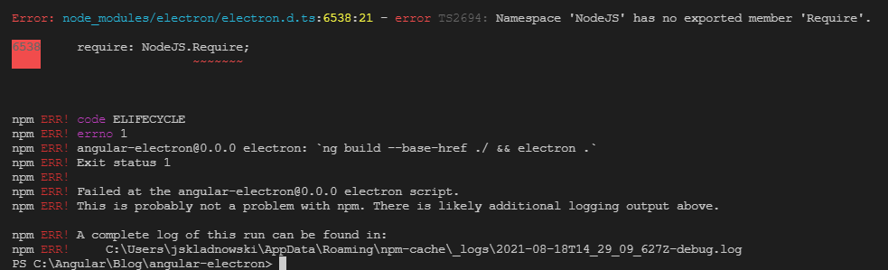

It looks like we now have an issue with Electron utilizing NodeJS.Require behind the scenes. What happened? Whatever is supplying the definition for NodeJS might be incorrect.  Looking at the package.json file we can see that the types package for Node is using version 12.  We need to use version 14 or higher.  Update this to be 14 or greater (currently 16 is latest at the time of this tutorial.) and run the following again.
``` 
package.json

"@types/node": "16.6.1"
```

``` npm i ```

If you are on a later version of Angular 12 it is possible that the application will work at this time.  If it is working for you, great!  If not, read below.

You are now likely facing issues with Node modules.

```
Module not found: Error: Can't resolve 'fs' in {folder path}
Error: Can't resolve 'path' in {folder path}
```

In Webpack 5, NodeJS polyfills are no longer supplied by default. Traditionally we would use Webpack to add any polyfills if needed but since Angular 6 the Webpack eject functionality has been removed. We will need a way of adding these polyfills to Webpack for this to work.

Thankfully, there is a Webpack plugin to help here that is available through npm.  Let's install it now in the app.

``` npm i -D node-polyfill-webpack-plugin ```

Now we need some way to add this to Webpack.  To do this we are going to have to make updates to the Angular builder that is being used.  We will need to install the custom webpack builder.

``` npm i -D @angular-builders/custom-webpack ```

Before we can utilize this tooling, we will need to create a custom webpack configuration file.  In the root of your application add a file 'polyfill-webpack.config.js'.

We will keep this simple for this purpose but note that you can add any necessary missing polyfills here to execute your application.

```
const NodePolyfillPlugin = require("node-polyfill-webpack-plugin")

module.exports = {
  
  plugins: [
    new NodePolyfillPlugin({
      excludeAliases: ["console"]
    })
  ],
  resolve: {
    fallback: {
        fs: false,
    }
  }
};
```
we will exclude the console polyfill as we can use the browser console and for the purposes of this tutorial, we will set the fs polyfill resolution to false.  If you need to use fs or other similar functionality in your applications, you will need to import them from a library like browserify and resolve fs: using the require browserify library instead of false.  False will ignore any dependency errors for that functionality.

Now that we have a custom webpack config we need to tell Angular to use it when building the application.
Open your angular.json file and look for the builder property in the architect folder (projects:{app-name}:architect:build:builder)

Replace "@angular-devkit/build-angular:browser" with "@angular-builders/custom-webpack:browser".

In the options below, we need to tell Angular where to find out custom webpack config.  Add the following object to the options.

```
"customWebpackConfig": {
    "path": "./polyfill-webpack.config.js",
    "replaceDuplicatePlugins": true
}
```
We will also need to update the serve functionality to use the custom webpack builder.

in the same angular.json file scroll down to the serve property and update the builder from "@angular-devkit/build-angular:dev-server" to "@angular-builders/custom-webpack:dev-server"

Start the application again.

``` npm run electron ```

SUCCESS! Note the Electron header we added.
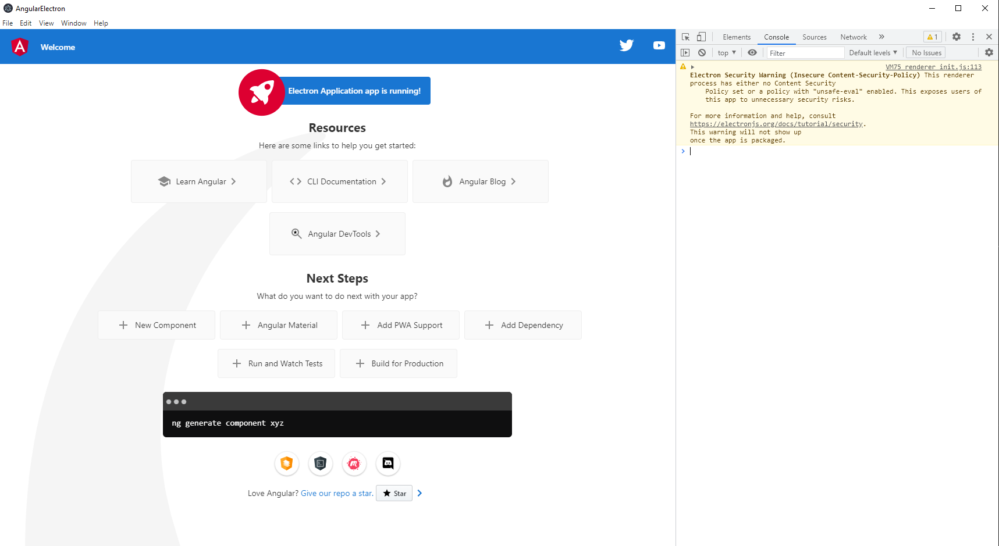

Running the Angular in the browser should still work let’s test it!

``` ng serve -o ```

SUCCESS!
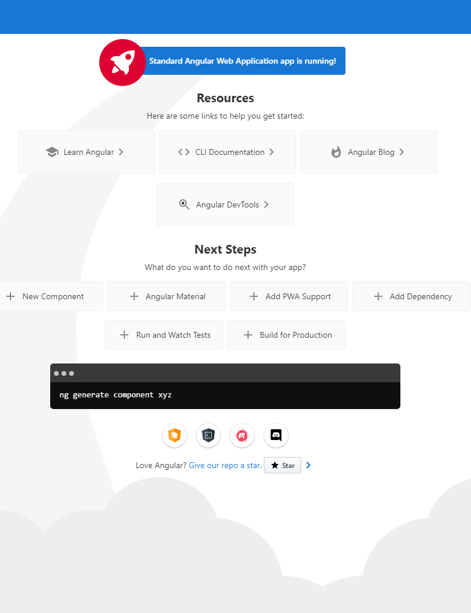

In some rare cases you may experience compilation errors about common.js dependencies.  To remedy this open your tsconfig.json file and update the target property to "es5".

I hope this has helped anyone who was running into issues!

## The Short Version

### Repository
[View the repository](https://github.com/tallan/angular-electron)

### Machine Installed Dependencies
Node: 14.16.1
Package Manager: npm 6.14.12
OS: win32 x64

Angular: 12.2.1
... animations, cli, common, compiler, compiler-cli, core, forms
... platform-browser, platform-browser-dynamic, router

Package                         Version
---------------------------------------------------------
@angular-devkit/architect       0.1202.1
@angular-devkit/build-angular   12.2.1
@angular-devkit/core            12.2.1
@angular-devkit/schematics      12.2.1
@schematics/angular             12.2.1
rxjs                            6.6.7
typescript                      4.3.5


### Folder Structure

(GREEN: Added, YELLOW: Modified) Ignore the Images and README addition and changes.

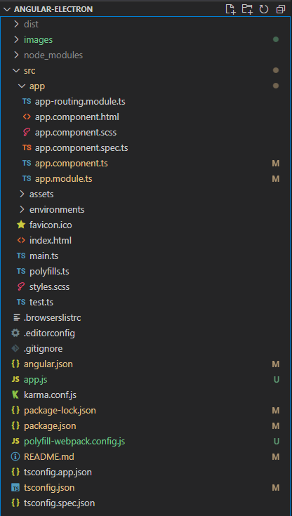

### Make the following changes to your application.
angular.json

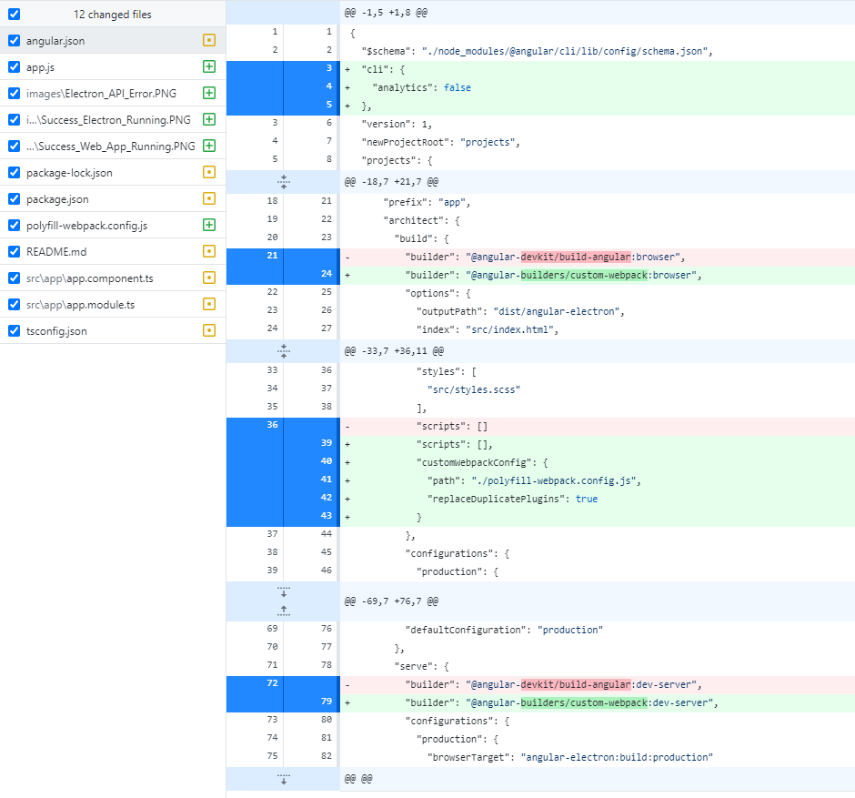

app.js

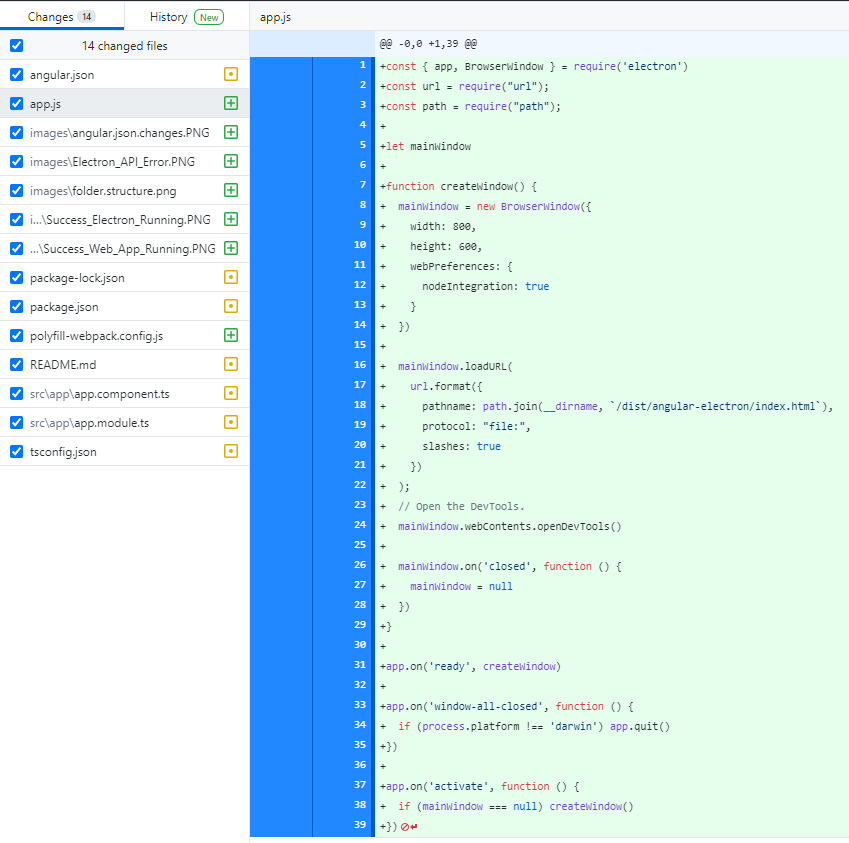

package.json

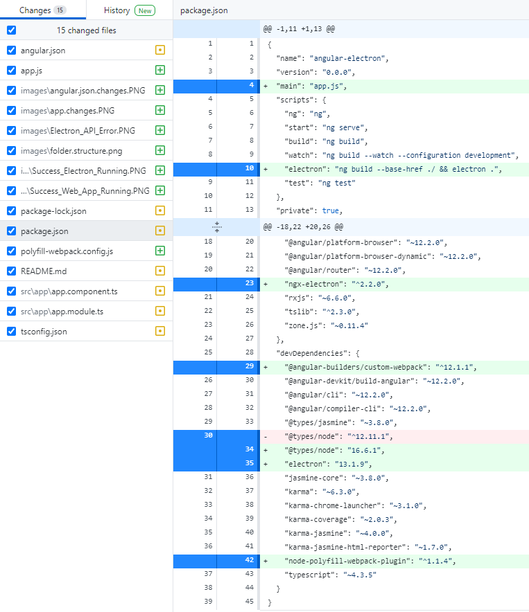

polyfill-webpack.config.js

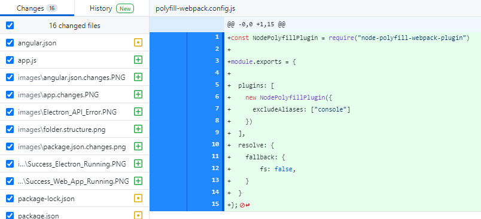

app.component.ts

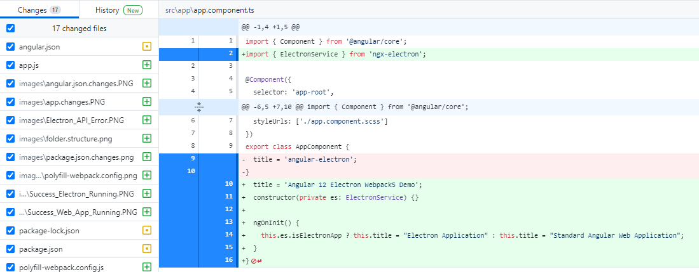

app.module.ts

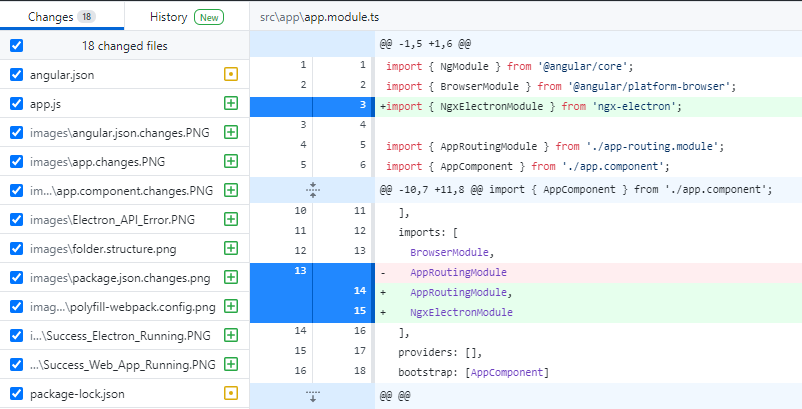

tsconfig.json

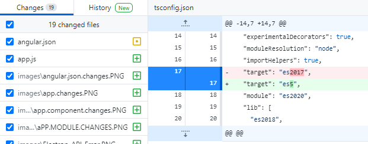


